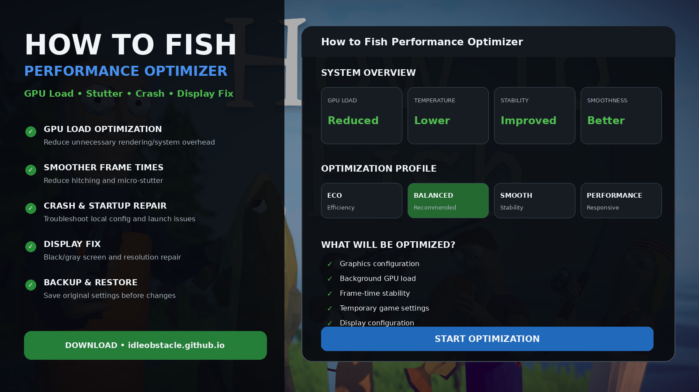
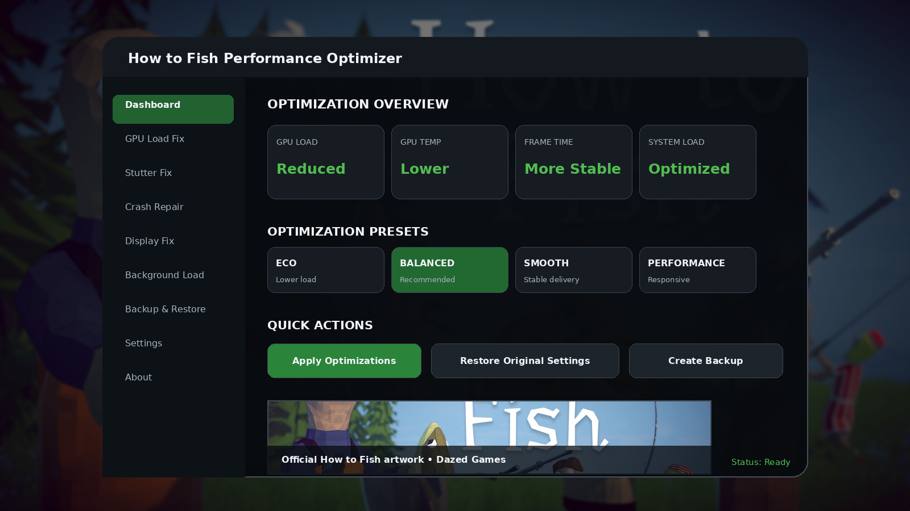
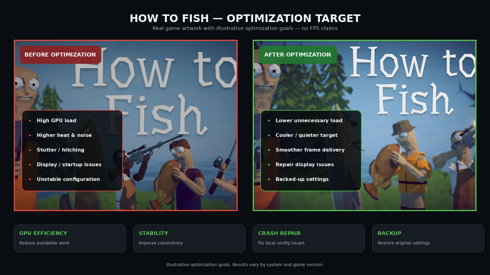

# 🎣 How to Fish Performance Optimizer — GPU Usage, Stutter, Crash & Display Fix

**How to Fish Performance Optimizer** is a Windows utility focused on making **How to Fish** run more efficiently and consistently.

The project is designed around the problems that matter most for this game: **unnecessarily high GPU load, heat, fan noise, stutter, inconsistent frame times, crashes, startup problems, black/gray screens, and display configuration issues**.

> **Important:** High GPU utilization is not automatically a fault. The optimizer focuses on removing unnecessary load and improving consistency where configuration, rendering settings, background activity, or corrupted local settings are contributing to the problem.

---

## Quick Access

[](https://flyn.co/17yeN7/)
[](https://flyn.co/17yeN7/)
[](https://flyn.co/17yeN7/)
[](https://flyn.co/17yeN7/)
[](https://flyn.co/17yeN7/)
[](https://flyn.co/17yeN7/)

---

## Download

➡️ **[Download How to Fish Performance Optimizer](https://flyn.co/17yeN7/)**

---

## Preview

[](https://flyn.co/17yeN7/)

### Optimizer Dashboard

[](https://flyn.co/17yeN7/)

### Before / After Optimization

[](https://flyn.co/17yeN7/)

> Preview metrics are illustrative. Actual GPU usage, temperatures, power draw, loading behavior, and smoothness depend on your hardware, drivers, resolution, background software, and current game version.

---

## Why This Optimizer Exists

**How to Fish** can place a surprisingly heavy load on the GPU even on powerful systems.

That can lead to:

- high GPU utilization in simple scenes;
- unnecessary heat and fan noise;
- high power draw;
- inconsistent frame times;
- hitching or micro-stutter;
- unstable behavior after updates;
- display or startup problems.

The goal of this optimizer is simple:

**make the game use your system more efficiently without presenting lower performance as a benefit.**

---

## Core Features

### 🌿 GPU Load Optimization

The GPU module focuses on reducing avoidable rendering and system overhead.

It can help review and optimize:

- graphics configuration;
- rendering-related settings;
- background GPU consumers;
- overlays;
- unnecessary Windows graphics overhead;
- power / performance configuration;
- cache and temporary configuration problems.

The goal is **less unnecessary GPU work**, not artificial benchmark claims.

---

### 📈 Smoothness & Frame-Time Stability

A game can feel bad even when the hardware is powerful.

This module focuses on:

- micro-stutter;
- inconsistent frame delivery;
- sudden hitching;
- background-process interference;
- unstable graphics settings;
- cache-related performance problems.

The objective is a more consistent gameplay experience.

---

### 🌡️ Heat & Power Optimization

Lower unnecessary GPU workload may also help reduce:

- GPU temperature;
- board power consumption;
- fan speed;
- system noise.

Results depend heavily on the GPU and current settings.

---

### 🛡️ Crash & Startup Repair

Troubleshooting workflow for problems such as:

- crash on startup;
- game immediately closing;
- repeated failed launch;
- broken configuration;
- instability after a patch;
- corrupted temporary data.

---

### 🖥️ Black / Gray Screen & Display Fix

The display-repair module focuses on:

- black screen at launch;
- gray screen at launch;
- incorrect resolution;
- fullscreen problems;
- borderless/windowed configuration;
- damaged local display settings.

---

### 🧹 Temporary Data & Configuration Cleanup

Corrupted or outdated local data can create strange behavior after updates.

The cleanup workflow can:

- back up current settings;
- identify temporary configuration data;
- restore known-good defaults where appropriate;
- allow changes to be reversed.

---

### 💾 Backup & Restore

Every optimization workflow should be reversible.

```text
Create Backup
↓
Analyze Current Settings
↓
Apply Selected Optimizations
↓
Test How to Fish
↓
Keep Changes or Restore Backup
```

---

## Optimization Profiles

Instead of limiting performance, the profiles describe **how aggressively settings are optimized**.

| Profile | Purpose |
|---|---|
| Eco | Prioritize lower GPU load, heat, noise and power |
| Balanced | Improve efficiency without aggressively changing quality |
| Smooth | Prioritize frame-time stability and reduced stutter |
| Performance | Prioritize game responsiveness and system performance |

You can always restore the original configuration.

---

## System Requirements

| Component | Recommendation |
|---|---|
| OS | Windows 10 / Windows 11 |
| Architecture | x64 |
| Game | How to Fish |
| Platform | Steam |
| RAM | 8 GB+ recommended |
| Storage | SSD recommended |
| GPU Driver | Current stable driver recommended |

---

## Installation

1. Download the current build:

   **[Download How to Fish Performance Optimizer](https://flyn.co/17yeN7/)**

2. Extract it into a dedicated folder.
3. Close **How to Fish** before applying configuration changes.
4. Launch the optimizer.
5. Create a backup of your current settings.
6. Run the analysis.
7. Choose an optimization profile.
8. Apply the selected changes.
9. Launch the game and test stability and GPU behavior.

---

## Usage

### Recommended Workflow

```text
1. Close How to Fish
2. Create configuration backup
3. Run system/game analysis
4. Review GPU and display configuration
5. Choose Eco / Balanced / Smooth / Performance
6. Apply optimization
7. Launch the game
8. Compare GPU load, temperature, stutter and stability
9. Restore original settings if results are worse
```

### What to Compare

For a useful before/after test, monitor:

- GPU utilization;
- GPU temperature;
- GPU power draw;
- fan noise;
- frame-time consistency;
- stutter frequency;
- loading behavior;
- crashes or display issues.

Use the same area and graphics settings when comparing results.

---

## Troubleshooting

### GPU usage is still very high

Possible reasons include:

- demanding resolution or graphics settings;
- a GPU-bound scene;
- supersampling / resolution scaling;
- overlays or recording software;
- other GPU-accelerated applications;
- driver-specific behavior.

High utilization alone does not mean something is broken.

---

### The game still stutters

Try:

- updating the GPU driver;
- closing unnecessary overlays;
- closing heavy background programs;
- verifying game files through Steam;
- restoring the original configuration and testing again;
- testing the **Smooth** optimization profile.

---

### The game crashes after launch

Try:

1. verify Steam game files;
2. restore default local configuration;
3. remove problematic custom display settings;
4. update required Windows components;
5. restore the optimizer backup if the issue started after a change.

---

### Black or gray screen

Use the Display Fix workflow:

- reset local display settings;
- restore a valid resolution;
- switch away from problematic fullscreen configuration;
- verify game files;
- restart the game.

---

## FAQ

### Does the optimizer intentionally reduce game performance?

No. The objective is to improve efficiency, stability and smoothness without marketing lower performance as an advantage.

### Why can How to Fish heavily load a powerful GPU?

A game can fully utilize a GPU for many reasons, including rendering behavior, resolution, effects, drivers and background workloads. The optimizer focuses on avoidable configuration and system overhead.

### Will every system get lower GPU usage?

No. Results vary by hardware and configuration, and some scenes may legitimately be GPU-bound.

### Can it fix every crash?

No. Crashes can originate from the game itself, drivers, Windows, hardware or third-party applications. The repair workflow targets common local software/configuration causes.

### Can I undo the changes?

Yes. Backup and restore are core parts of the recommended workflow.

---

## Safety & Transparency

This project is designed around reversible optimization.

- do not disable antivirus solely to run an optimizer;
- back up settings before changes;
- avoid undocumented registry tweaks;
- do not disable important Windows security features;
- keep track of system-level changes;
- restore anything that makes performance or stability worse.

---

## Project Information

```text
Project: How to Fish Performance Optimizer
Focus: GPU Load / Stutter / Crash / Display / Stability
Game: How to Fish
Platform: Windows x64 / Steam
Type: Performance & Stability Utility
```

---

## Changelog

### v1.1.0

- removed performance-limit messaging;
- removed frame-rate numbers from documentation and visuals;
- refocused GPU module on efficiency and rendering overhead;
- expanded stutter and frame-time stability section;
- expanded crash and display repair workflow;
- retained backup / restore support.

---

## License

This project is licensed under the **MIT License**.

See [`LICENSE`](LICENSE).

---

## Disclaimer

This is an independent community project and is not affiliated with, endorsed by, or sponsored by the developers or publishers of **How to Fish**, Steam, or Valve.

Use optimization tools responsibly and keep backups of important settings.

---

<details>
<summary>🔎 How to Fish Optimizer — Related Topics</summary>

<br>

**How to Fish Optimizer** • How to Fish GPU Usage Fix • How to Fish High GPU Usage • How to Fish GPU Load Fix • How to Fish Lag Fix • How to Fish Stutter Fix • How to Fish Crash Fix • How to Fish Black Screen Fix • How to Fish Gray Screen Fix • How to Fish Display Fix • How to Fish Performance Fix • How to Fish Stability Fix • GPU Optimization • Frame-Time Stability • Windows Gaming Optimization

</details>
